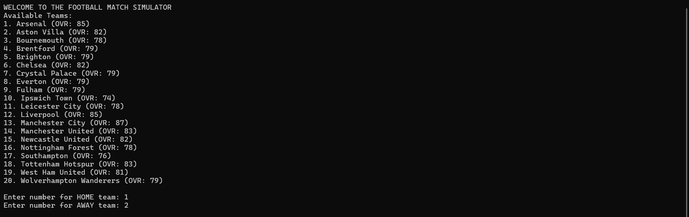

# Football Match Simulator

The Football Match Simulator is a text-based C++ program that lets you simulate a 90-minute football game between two professional teams. The simulation uses real-world team data and player ratings to determine the outcome of each match.

## What It Does
This simulator recreates a football match right in your command prompt. It includes:
* **Team Selection:** Choose from a list of teams loaded from a database.
* **Realistic Ratings:** Each team's strength is calculated based on the average ratings of its individual players.
* **90-Minute Simulation:** The program runs through every minute of the game, including a halftime break.
* **Dynamic Events:** Every minute has a chance to trigger a match event, such as:
    * **Goals:** Absolute screamers scored by specific players.
    * **Saves:** Goalkeepers making crucial stops.
    * **Fouls:** Players receiving yellow cards from the referee.
    * **Missed Shots:** Shots that go wide of the post.
    * **Offsides:** Players caught out of position.

## How to Use It

### Prerequisites
To run this project, you will need:
* A C++ compiler (the project is designed for **Visual Studio** on Windows).
* The `teams.txt` file located in the same folder as the code.

### Running the Simulator
1.  **Open the Project:** Open `Football-Match-Simulator.sln` in Visual Studio.
2.  **Build and Run:** Build and launch the program (typically by pressing **F5**).
3.  **Choose Your Teams:** * The program will display a list of available teams.
    * Type the number of your chosen **Home** team and press Enter.
    * Type the number of your chosen **Away** team and press Enter.
4.  **Watch the Match:** The simulator will play through the game, announcing goals and events as they happen in real-time.
5.  **Final Results:** At the end of 90 minutes, the final score will be displayed. You can then choose to play another match or exit the program.

## Project Files
* **`Football-Match-Simulator.cpp`:** The main source code that handles the logic, team loading, and match simulation.
* **`teams.txt`:** The database file containing team names, player names, and their skill ratings.
* **`Football-Match-Simulator.sln`:** The Visual Studio Solution file used to manage the project.
* **`.gitignore` / `.gitattributes`:** Configuration files used for version control.

## What's Next? (Roadmap)
- [ ] **Tactics:** Add "Attacking" or "Defensive" options that change a team's chances of scoring or conceding.
- [ ] **More Leagues:** Add Leagues so you can play againist a varity of teams from different leagues e.g. La Liga, Bundesliga, Serie A, Ligue 1.
- [ ] **Tournament Mode:** Upgrade the main menu to allow for knockout-style tournaments instead of just single matches.

## Demo
**Team Selection**:

**Match Simulation**:
